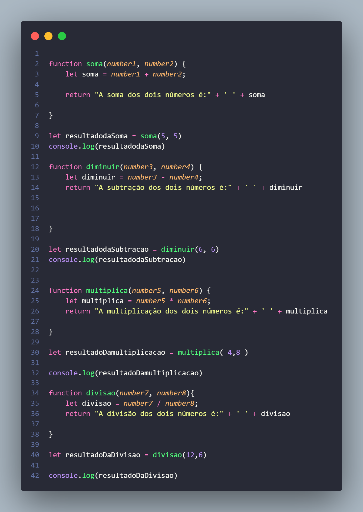

### Desafio Dev Quest JavaScript Básico 🚀🚀

### Segue imagem do código.

[]

###  Criando mais de uma função.
### Com os conhecimentos adquiridos na aula de
### funções crie uma função para cada operação
### matemática (soma, divisão, multiplicação e subtração).

### Realize a chamada de cada função, colocando
### cada resultado em uma variável e mostre a resposta usando o console.log.

